# セットアップ手順書 — IGインサイト保存テンプレート

Instagram Graph APIで全投稿のインサイトを、自分のスプシに永続保存する仕組み。

**所要時間**: Zoom同伴で約90分／自分で進める場合は60〜120分

---

## 目次

- [Step 0. 進め方・必要なもの](#step-0-進め方必要なもの)
- [Step 1. マスタースプレッドシートをコピー](#step-1-マスタースプレッドシートをコピー)
- [Step 2. Meta Developer 登録 + アプリ作成](#step-2-meta-developer-登録--アプリ作成)
- [Step 3. 権限追加](#step-3-権限追加)
- [Step 4. APP_ID / APP_SECRET 取得 → スプシ登録](#step-4-app_id--app_secret-取得--スプシ登録)
- [Step 5. 短期アクセストークン取得（Graph API Explorer）](#step-5-短期アクセストークン取得graph-api-explorer)
- [Step 6. 接続テスト → 自動で長期化](#step-6-接続テスト--自動で長期化)
- [Step 7. IG_USER_ID 自動取得・自動保存](#step-7-ig_user_id-自動取得自動保存)
- [Step 8. Drive画像保存フォルダ自動作成](#step-8-drive画像保存フォルダ自動作成)
- [Step 9. Gemini APIキー（OCR用・任意）](#step-9-gemini-apiキーocr用任意)
- [Step 10. Discord Webhook 設定（通知用・任意）](#step-10-discord-webhook-設定通知用任意)
- [Step 11. 過去全件取り込み（API）](#step-11-過去全件取り込みapi)
- [Step 12. Meta公式zipアップロード（過去ストーリーズ用）](#step-12-meta公式zipアップロード過去ストーリーズ用)
- [Step 12-補. Business Suite CSV インポート（任意・補完用）](#step-12-補-business-suite-csv-インポート任意補完用)
- [Step 13. トリガー設置（自動取得開始）](#step-13-トリガー設置自動取得開始)
- [日々の運用](#日々の運用)
- [規約・データの扱い（重要）](#規約データの扱い重要)
- [FAQ](#faq)
- [アフターフォロー](#アフターフォロー)

---

## Step 0. 進め方・必要なもの

本手順書は Step 1 から順番に進めれば、Instagramの全投稿インサイトを自分のスプシに自動保存する仕組みが完成します。Zoom同伴セットアップなら約90分、自分で進める場合は60〜120分が目安です。途中で詰まったら Discord コミュニティ（アフターフォロー加入者）でご質問ください。

> 💡 **必要なもの**
> - Googleアカウント（スプシ・Drive用）
> - Instagramビジネス/クリエイターアカウント（個人アカウントは不可）
> - Facebookページ（IGビジネスアカウントと連携済みのもの）
> - Meta開発者アカウント（無料・本手順内で作成）
> - Discordアカウント（通知用Webhookと購入者認証で使用）
> - （任意）Gemini APIキー — ストーリーズOCRを使う場合のみ

---

## Step 1. マスタースプレッドシートをコピー

1. 購入後にお送りした「マスタースプシ `?copy` URL」をブラウザで開く
2. 「コピーを作成」ボタンをクリック → 自分のGoogleドライブに複製される
3. 複製されたスプシを開く（ファイル名はそのままでもOK）
4. 「アクセスを許可」ダイアログが表示されたらクリック
5. メニュー「📊 Instagram Insights → 🔧 初回セットアップ（シート作成）」を実行 → 全シートが自動生成されます
6. 初回のみ権限承認ダイアログが出る → 「許可」を選択
7. スプシのメニューバーに「📊 Instagram Insights」が表示されていることを確認

> 💡 **所要**: 約2分

---

## Step 2. Meta Developer 登録 + アプリ作成

Instagram Graph API を使うために、まず Meta（旧 Facebook）の開発者アカウントを作成し、その配下に専用のアプリを1つ作ります。ここで作るアプリは「自分専用のデータ取得窓口」であって、世間に公開するものではありません。

### 2-A. Meta for Developers 初回登録（はじめての方のみ）

すでに [developers.facebook.com](https://developers.facebook.com) でアプリ作成画面に入れる場合は **2-A はスキップして 2-B へ** 進んでください。`developers.facebook.com/apps/` を開いて「アプリはまだありません」または既存アプリ一覧が表示されたら登録済みです。

#### 手順

1. ブラウザで [developers.facebook.com](https://developers.facebook.com) を開く

   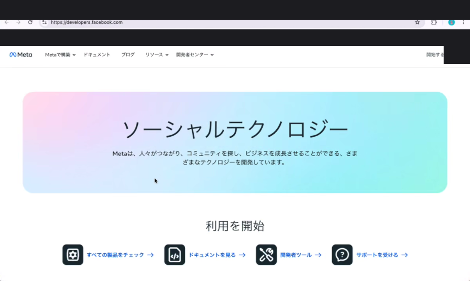

2. 右上「**開始する**」をクリック → 自分の Facebook アカウントでログイン
3. 「**Meta for Developersアカウントを作成**」ダイアログが開き、「ようこそ」画面で内容を確認 → 右下「**次へ**」をクリック

   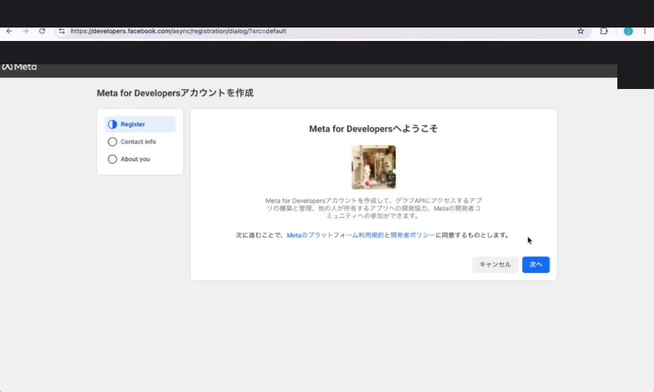

4. **Contact info（連絡先）** ステップに進む。Primary email に Facebook 登録メールが自動入力される → 「**メールアドレスを認証**」をクリック → 受信ボックスで認証メールを開いてリンクをクリック

   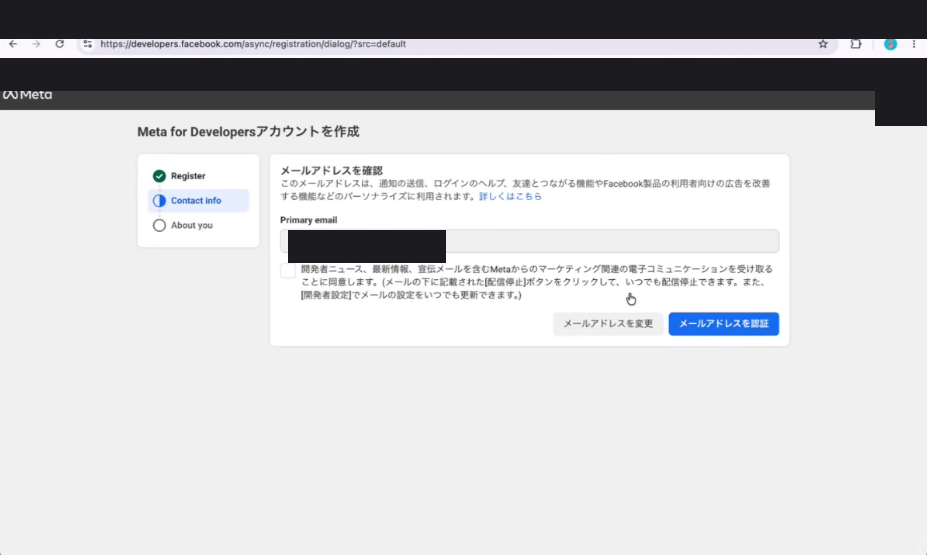

   > 💡 別のメールに変えたい場合は「メールアドレスを変更」から差し替え可能。認証用リンクは数分以内に届きます（届かない場合は迷惑メールフォルダを確認）。

5. **About you（役割選択）** ステップに進む。**「開発者」** を選択 → 「**登録完了**」をクリック

   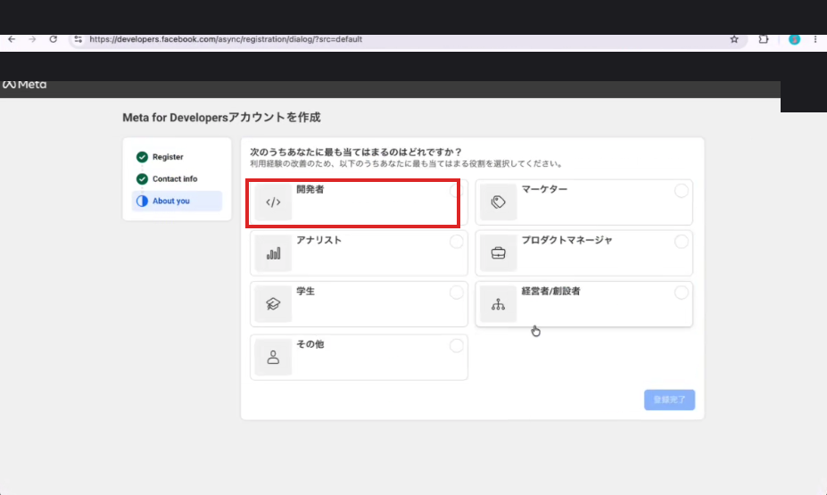

   > 💡 **「開発者」を選択** してください（画像の赤枠の位置）。役割選択はアプリ機能には影響しませんが、本テンプレートの用途では「開発者」が最も自然です。

6. 登録完了するとマイアプリ画面（`developers.facebook.com/apps/`）に遷移し、「**アプリはまだありません**」と表示されます。これで初回登録は完了です。

   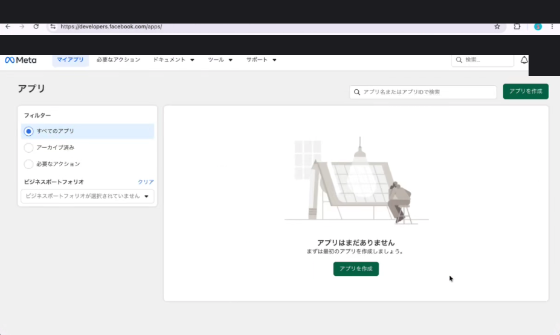

> 💡 **所要**: 約5分（メール認証の待ち時間込み）

> ⚠️ **登録がブロックされる場合**: Facebook 本体のアカウントが新規作成直後・利用実績がほぼ無い場合、開発者登録が「アカウントの確認が必要」とブロックされることがあります。その場合は数日 Facebook を通常利用してから再挑戦してください。

---

### 2-B. アプリを作成

新規アプリ作成は **5ステップ構成**（アプリの詳細 → ユースケース → ビジネス → 要件 → 概要）です。**ステップ2のユースケース選択画面で必要な権限を一気に入れる**のが最短ルート。

#### 手順

1. マイアプリ画面（`https://developers.facebook.com/apps/`）右上の「**アプリを作成**」をクリック
2. **ステップ1：アプリの詳細**
   - 「アプリ名」を入力（例: `ig-insights-自分のアカウント名`）
   - 「連絡先メールアドレス」を入力
   - 「アプリの種類」で **「ビジネス」** を選択
   - 「次へ」をクリック
   - ※「なし」「消費者」では Instagram Graph API の権限が付けられないので必ず **「ビジネス」** を選んでください
3. **ステップ2：ユースケース** ← ここで本テンプレに必要な権限を一気に追加

   - 左フィルターを **「コンテンツ管理」** に切り替え
   - **「Instagramでメッセージとコンテンツを管理」** にチェック
   - 右下「**次へ**」をクリック

   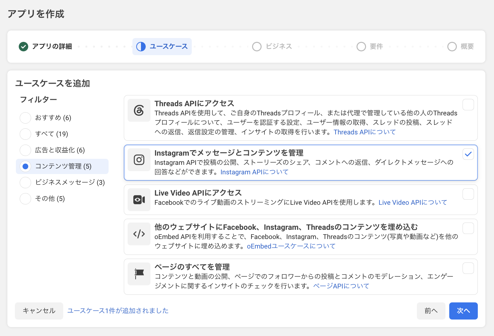

   > 💡 **このユースケースで入る権限**：`instagram_basic` / `instagram_manage_insights` 等の Instagram 系。残る `pages_read_engagement` / `pages_show_list` / `business_management` は Step 3 で追加します。

   > 💡 **この2つで5権限中4つがカバー**されます。残る `business_management` は Step 3 で追加します。

   > 💡 **「カスタマイズ」「ユースケースなしで作成」を選んでもOK**：「その他 (5)」タブにある「**ユースケースなしでアプリを作成**」を選んで空のアプリを作り、Step 3 で5権限を個別追加するルートも可能。ただし手数が多くなるので上記のコンテンツ管理タブから2つ選ぶのが推奨です。

4. **ステップ3：ビジネス**
   - ビジネスポートフォリオを選択（既存があれば該当を選ぶ、未作成ならその場で新規作成）
   - 「次へ」
5. **ステップ4：要件** — 表示内容を確認 → 「次へ」
6. **ステップ5：概要** — 内容を確認 → **「アプリを作成」**
7. パスワード再入力 → 場合により SMS 認証 → ダッシュボードに遷移すれば完了

   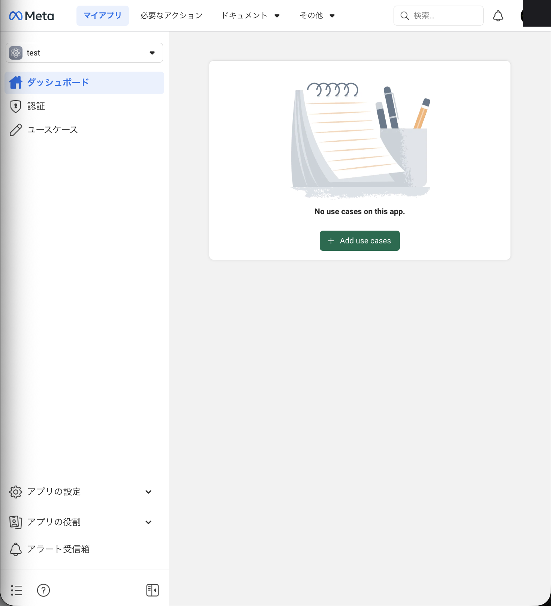

> 💡 **所要**: 約10分（SMS認証が入る場合は+5分）

> 💡 **「アプリの種類」と「ユースケース」は別物**：アプリの種類＝「ビジネス」、ユースケース＝コンテンツ管理タブの2つ、と覚えてください。

> ⚠️ **つまずきポイント**: 個人 Facebook アカウントだけでも作成できますが、後で別の運用者と共有する可能性があるならビジネスアカウント連携を推奨します。また、Facebook 本体のアカウント自体が新規作成直後だとアプリ作成がブロックされることがあります。その場合は数日アカウントを使い込んでから再挑戦してください。

---

## Step 3. 権限追加（不足分の追加 + 5権限の確認）

Step 2-B で「Instagramでメッセージとコンテンツを管理」+「ページのすべてを管理」の2ユースケースを追加していれば、**5権限中4つはすでに入っています**。Step 3 では：

1. 残る `business_management` を追加
2. 最終的に5権限すべて揃っているか確認

の2点を行います。

### 必要な5権限（Step 2-Bでどこまで入ったかの目安）

| 権限 | Step 2-B で追加済み？ | カバー元 |
|---|---|---|
| `instagram_basic` | ✅ 済 | Instagramでメッセージとコンテンツを管理 |
| `instagram_manage_insights` | ✅ 済 | Instagramでメッセージとコンテンツを管理 |
| `pages_read_engagement` | ✅ 済 | ページのすべてを管理 |
| `pages_show_list` | ✅ 済 | ページのすべてを管理 |
| **`business_management`** | ❌ **未** | ここで追加します |

### 手順：`business_management` を追加

1. アプリダッシュボード左メニュー「**ユースケース**」をクリック
2. 既に追加されたユースケース一覧が表示される（Instagram〜 と ページ〜 の2つ）
3. **「ユースケースを追加」** または **「+」** ボタンをクリック → ユースケース追加ダイアログが開く

   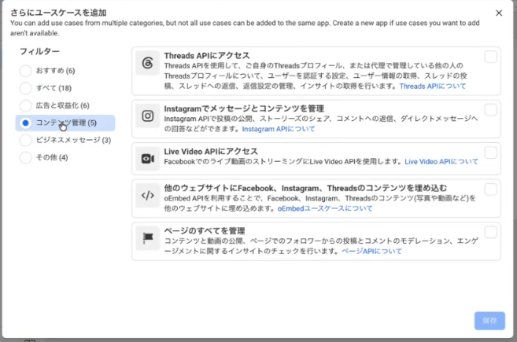

   > 💡 **フィルターの読み方**: 「おすすめ / すべて / 広告と収益化 / コンテンツ管理 / ビジネスメッセージ / その他」を切り替えて、表示される候補を絞り込めます。

4. **「その他 (5)」** タブ → **「ユースケースなしでアプリを作成」** にチェック → 保存
   - これで「カスタマイズ」相当の枠が追加され、個別権限を足せる状態になります
5. 追加されたカスタマイズ枠を開いて、**「権限とアクセスを追加」**（Permissions and Features）から `business_management` を検索 → 「追加」をクリック

### 5権限すべて揃っているか確認

ユースケース一覧 or 各ユースケース詳細から、以下の5つすべてが付いていれば Step 3 完了：

- `instagram_basic` — 基本情報・メディア取得
- `instagram_manage_insights` — インサイト数値取得
- `pages_read_engagement` — Facebookページ経由でのIG接続
- `pages_show_list` — ページ一覧取得
- `business_management` — ビジネスアカウント管理

> 💡 **5権限すべて揃わなくても次へ進めます**：実際の確認は Step 6 の接続テストで行います。そこで「権限不足」エラーが出たら Step 3 に戻ってください。

> 💡 **所要**: 約5分

> ✅ **アプリ審査は不要です** — 自分の IG アカウントのみを取得対象とする「開発モード（テスター追加）」で運用するため、Meta のアプリ審査（App Review）も本番モードへの切り替えも不要です。「開発モード」のままで本テンプレートの全機能が動作します。第三者のアカウントは取得しません。

> ⚠️ **つまずきポイント**: 権限名の右側に「Standard Access」や「Advanced Access」の表示がありますが、開発モード運用なら **Standard Access のままでOK** です。Advanced Access に上げようとするとアプリ審査が必要になり、本テンプレートの想定外になります。

---

## Step 4. APP_ID / APP_SECRET 取得 → スプシ登録

アプリの「身分証明書」にあたる2つの値（アプリID と アプリシークレット）を取得し、自分のスプシに登録します。この2つは Step 6 で短期トークンを60日長期トークンに自動変換するときに必要になります。

### 手順

1. アプリダッシュボード左メニュー「設定」→「基本設定」を開く
2. 画面上部に表示される **「アプリID」**（公開値・15〜17桁の数字）をコピー
3. その下の **「アプリシークレット」** 欄で「表示」ボタンをクリック → Facebook パスワード再入力 → 表示されたシークレットをコピー
4. 自分のスプシを開いて「⚙️ 設定」シートを表示
5. 「Facebook アプリID」の B 列にアプリID を貼り付け
6. 「Facebook アプリシークレット」の B 列にアプリシークレットを貼り付け
7. スプシのメニュー「📊 Instagram Insights → 💾 設定シートからPropertiesに保存」を実行
8. 「保存しました」アラートが出れば Script Properties への反映完了

> 💡 **所要**: 約3分

> ⚠️ **アプリシークレットの取り扱い** — アプリシークレットは「アプリのパスワード」に相当する機密情報です。以下を厳守してください:
> - 公開リポジトリ（GitHub等）にコミットしない
> - Discord・Slack・チャット等にそのまま貼り付けない
> - スクリーンショットを SNS にアップしない（特に質問投稿時）
> - スプシを第三者と共有する場合は、設定シートを非表示またはアクセス制限する
>
> 万が一漏洩した場合は、Meta のアプリ設定画面から「アプリシークレットをリセット」して即時失効させてください。

---

## Step 5. 短期アクセストークン取得（Graph API Explorer）

Meta が提供する「Graph API Explorer」というブラウザツールで、まず **1時間有効の短期アクセストークン** を取得します。次の Step 6 で、このトークンが自動的に60日有効の長期トークンに変換されます。

> ⚠️ **Step 3 と Step 5 の違い（同じ権限名が出てきますが別作業です）**
>
> Step 3 と Step 5 は **同じ5つの権限名**（`instagram_basic` 等）を扱うため「同じ作業を2回している？」と感じやすいですが、**別の作業**です。両方完了して初めて API を呼べる状態になります。
>
> | Step | 操作場所 | 役割 | 例えるなら |
> |---|---|---|---|
> | **Step 3** | アプリ管理画面（**アプリ側**） | アプリが「この権限を使います」と**宣言** | 求人票に「Excel使います」と書く |
> | **Step 5** | Graph API Explorer（**ユーザー側**） | 自分のアカウントから「この権限を**渡す**」と承認してトークンを発行 | 入社後に実際にExcelのライセンス鍵を受け取る |
>
> - **Step 3 だけ**完了 → トークンが無いので API を呼べない
> - **Step 5 だけ**やろうとしても → Step 3 で宣言していない権限はドロップダウンに出ない（or「Generate Access Token」で権限未設定エラー）
> - **両方完了** → トークンに5権限が紐づいて API を呼べる

### 5-A. 事前確認：アプリが「未公開（開発モード）」になっていることを確認

短期トークン取得の前提として、Step 2 で作ったアプリが **開発モード（未公開）** で動いている必要があります。本テンプレートは開発モードのまま運用するので、未公開のままでOKです。

1. アプリダッシュボード（`https://developers.facebook.com/apps/`）から対象アプリを開く
2. 左メニューに「**公開**」項目があり、ステータスが「**未公開**」になっていることを確認

   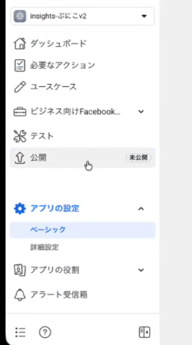

> 💡 「未公開」=「開発モード」と同じ意味。Standard Access の権限なら未公開のまま本テンプレ機能が全て動作します。

### 5-B. Graph API Explorer を開いて準備

1. [developers.facebook.com/tools/explorer](https://developers.facebook.com/tools/explorer) を開く
2. 右側パネル「**Metaアプリ**」のドロップダウンで、Step 2 で作成した自分のアプリを選択
3. 「**ユーザーまたはページ**」のドロップダウンで「**トークンを取得**」を選択
4. 「**アクセス許可**」セクションに初期状態の `public_profile` が表示されているのを確認

   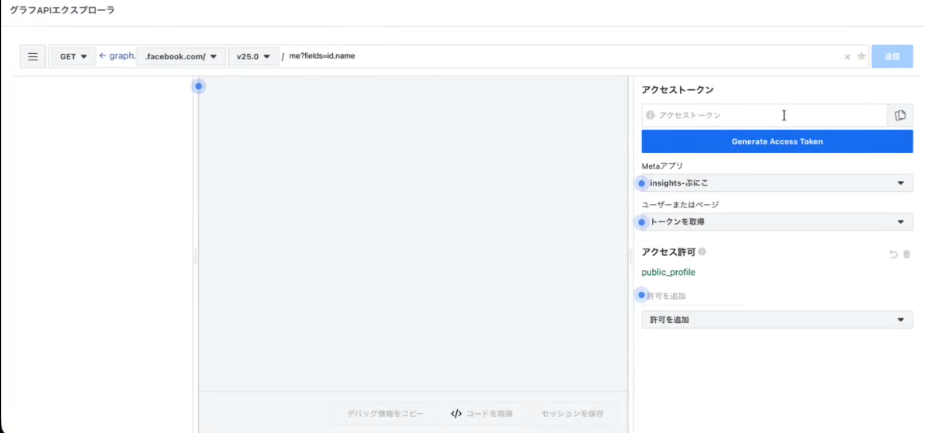

### 5-C. アクセス許可を5つ追加

「**許可を追加**」のドロップダウンから、以下の5つを **1つずつクリックして追加** します（チェックリスト形式ではなく、選択するたびにリスト上部に追加されていきます）。

追加する5つ:

- `instagram_basic`
- `instagram_manage_insights`
- `pages_read_engagement`
- `pages_show_list`
- `business_management`

#### 操作の流れ

1. 「**許可を追加**」ドロップダウンをクリック → カテゴリ一覧が表示される（**Events Groups Pages** / **Other** など）

   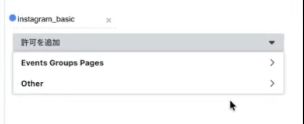

2. **Other** カテゴリを開く → `instagram_basic` をクリックして選択。「アクセス許可」セクションに追加される

   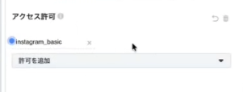

3. 同じ手順で残り4つ（`instagram_manage_insights` / `pages_read_engagement` / `pages_show_list` / `business_management`）も順次追加。ドロップダウンの **Other** や **Events Groups Pages** から検索/選択

   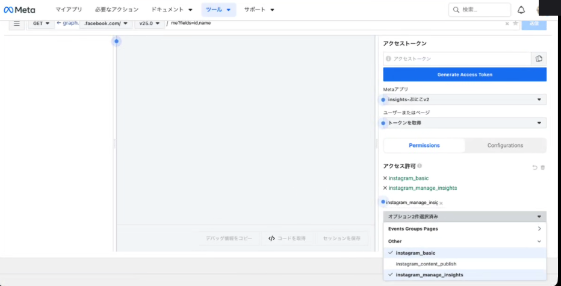

4. 5つすべて追加し終わると、「アクセス許可」セクションに5件が `×permission_name` の形で並びます

   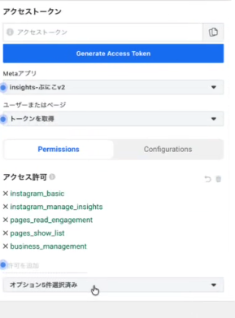

> 💡 **権限が見つからない場合**: ドロップダウン上部の検索ボックスに `instagram_basic` のように直接打ち込めばフィルタできます。

### 5-D. トークンを生成してスプシに貼付

1. 右側上部の **「Generate Access Token」** ボタンをクリック
2. Facebook ログイン承認画面が開く → 「対象の Facebook ページ」「対象の Instagram ビジネスアカウント」にチェックが入っていることを確認 →「次へ」→「保存」
3. Graph API Explorer の「**アクセストークン**」欄に長い文字列が表示されたらコピー
4. 自分のスプシ「⚙️ 設定」シートの「Instagram アクセストークン」B 列に貼り付け
5. メニュー「📊 Instagram Insights → 💾 設定シートからPropertiesに保存」を実行

> 💡 **所要**: 約5分

> ⚠️ **短期トークンは1時間で切れます** — このトークンは取得から1時間で失効します。短期トークン貼付後は **すぐに次の Step 6（接続テスト）** に進んで、60日長期トークンへの自動変換まで一気に終わらせてください。1時間以内に Step 6 を実行できなかった場合は、Step 5 をやり直して短期トークンを取り直すだけでOKです（やり直しは何度でも無料）。

> 💡 **権限選択画面が出ない場合**: ブラウザの広告ブロッカーやポップアップブロックを一時的に無効化してください。それでも出ない場合はシークレットウィンドウで再試行が確実です。

---

## Step 6. 接続テスト → 自動で長期化

このステップが本テンプレートの「肝」です。メニューを1回クリックするだけで、(1) Graph API への接続確認、(2) 短期トークンを60日長期トークンへ自動交換、(3) IG_USER_ID の自動取得・自動保存、までを内部で一気に処理します。

### 手順

1. スプシのメニュー「📊 Instagram Insights → 🔗 接続テスト」を実行
2. 初回のみ Apps Script の権限承認ダイアログが出る → 「許可」
3. 処理が走り始めると、内部で以下が自動実行されます:
   - ① 短期トークンで Graph API 接続 → 自分の IG ユーザー名・投稿数を取得
   - ② FB_APP_ID と FB_APP_SECRET を使って **短期トークン → 60日長期トークン** へ自動交換
   - ③ 取得した IG_USER_ID を Script Properties に自動保存
   - ④ 設定シートの該当欄にも自動で値を書き戻し
4. 「✅ 接続成功！ ユーザー名: ◯◯ / 投稿数: ◯件」のアラートが出れば完了

> ✅ **🎉 ここまで来れば認証系は完了です** — このあと60日間はトークン更新を意識しなくてOK。さらに Step 13 でトリガーを設置すれば、毎週日曜にトークンが自動でリフレッシュされ続けます。

> 💡 **所要**: 約30秒

> ⚠️ **失敗時のチェックポイント**:
> - **「Instagram API Error」** → Step 3 の権限が不足しています。5つすべて付いているか、Step 5 の Graph API Explorer で5つすべてチェックしたかを確認
> - **「長期トークン変換失敗」** → Step 4 の FB_APP_ID / FB_APP_SECRET が未設定または値が間違っています。設定シートを再確認 → 💾 で再保存
> - **「IG_USER_ID が取れない」** → IG アカウントが Facebook ページと連携されていない可能性があります。Meta Business Suite で連携状態を確認してください
> - **「アクセストークン期限切れ」** → 短期トークン取得から1時間以上経過。Step 5 をやり直して短期トークンを取り直し → 即 Step 6 を再実行

---

## Step 7. IG_USER_ID 自動取得・自動保存

IG_USER_ID は Instagram ビジネスアカウントを Graph API 上で識別するための数字15〜17桁のID です。本テンプレートでは **Step 6 の接続テストの中で自動取得・自動保存される** ため、このステップで利用者が手動操作することは基本ありません。

> 💡 **このステップは「確認のみ」** — Step 6 を実行済みであれば、すでに IG_USER_ID は Script Properties と設定シートの両方に書き込まれています。新しく操作することは何もありません。

### 確認手順

1. スプシ「⚙️ 設定」シートを開く
2. 「Instagram ユーザーID」欄の B 列に **15〜17桁の長い数字** が入っていることを確認（例: `17841401234567890`）
3. もし空欄のままなら Step 6 の接続テストが正常に完了していない可能性があります → Step 6 をもう一度実行

> 💡 **所要**: 約30秒（確認のみ）

> ⚠️ **つまずきポイント**: IG_USER_ID は Instagram の表示用ユーザー名（`@your_account`）とは **別物** です。長い数字列が入っていれば正常。アルファベット混じりの場合や桁数が極端に少ない場合は、別の値が誤って入っている可能性があるので Step 6 から再実行してください。

---

## Step 8. Drive画像保存フォルダ自動作成

Instagram の画像・動画サムネイル URL は Meta 側で時間経過とともに失効します（CDN URL のため）。本テンプレートでは投稿取得時に画像実体を **自分の Google Drive にコピー保存** し、永久に手元に残るようにします。そのための保存先フォルダをこのステップで自動作成します。

### 手順

1. スプシのメニュー「📊 Instagram Insights → 📁 Drive画像保存フォルダを準備」を実行
2. 初回のみ Drive 関連の権限承認ダイアログ → 「許可」
3. 処理が走ると以下が自動実行されます:
   - ① 自分の Google Drive 直下に「**IGインサイト画像保存**」フォルダを新規作成
   - ② フォルダの URL とフォルダ ID をアラートで表示
   - ③ 設定シート「Googleドライブ フォルダID」欄に自動で値を書き込み
   - ④ Script Properties にも自動保存
4. 「📁 フォルダを作成しました」アラートが出れば完了

フォルダ内の構造（取得実行時に自動生成されます）:

```
IGインサイト画像保存/
  ├── feed/      ← フィード投稿の画像
  ├── reels/     ← リールのサムネイル
  └── stories/   ← ストーリーズの画像
```

> 💡 **所要**: 約30秒

> 💡 **容量の目安**: 1投稿あたり画像1〜2MB、月30投稿なら年間で約1GB 程度。Google Drive の無料枠（15GB）でも数年分は収まります。容量が気になる場合は、設定シートの「画像保存をスキップ」フラグを ON にすれば URL のみ記録モードに切り替えられます。

> ⚠️ **つまずきポイント**: 既に「IGインサイト画像保存」フォルダが手動で作られていた場合、本機能はそのフォルダを上書きせず、新しく別フォルダを作って ID をそちらに書き換えます。重複が気になる場合は古いフォルダを Drive 上で削除してください。

---

## Step 9. Gemini APIキー（OCR用・任意）

ストーリーズに焼き込まれたテキスト（手書き風キャプション・スタンプ文字・スクショ内の文字など）を、Google の Gemini Vision で自動 OCR してスプシに記録する機能のセットアップです。**OCR が不要なら Step 9 はまるごとスキップしてOK** です（テンプレート本体の動作に影響なし）。

### 手順

1. [aistudio.google.com](https://aistudio.google.com) を開いて Google アカウントでログイン
2. 左サイドバー「Get API key」をクリック
3. 「Create API key」ボタンをクリック
4. 「Select Google Cloud project」で既存プロジェクトを選ぶか、「Create API key in new project」で新規作成
5. 発行された API キー（`AIza...` で始まる文字列）をコピー
6. 自分のスプシ「⚙️ 設定」シートを開く
7. 「Gemini APIキー」B 列に貼り付け
8. メニュー「📊 Instagram Insights → 💾 設定シートからPropertiesに保存」を実行

> 💡 **所要**: 約5分

> 💡 **月額試算**: ストーリーズ100件/月の OCR で **約 $0.05（≒ 7円）**。Gemini API の無料枠（1日あたりのリクエスト上限）でほぼカバーできるレンジなので、個人運用なら実質ゼロ円で運用可能です。

> ⚠️ **OCR 不要な場合**: ストーリーズ画像内のテキスト抽出を行わなくても、画像実体は Step 8 の Drive フォルダに保存され、ストーリーズの基本数値（リーチ・閲覧数・反応数等）も問題なく取得できます。OCR は「あとで検索したい」「テキスト分析したい」場合の **追加機能** という位置付けです。

> 🚫 **APIキーの取り扱い** — Gemini API キーも Step 4 のアプリシークレットと同じく機密情報です。公開リポジトリにコミット・チャットへの貼付・スクショ共有は厳禁。漏洩した場合は AI Studio から該当キーを即時失効させて再発行してください。

> 💡 **Gemini API が呼ばれるのはどのメニュー？**
>
> | メニュー | Gemini使用 |
> |---|---|
> | 📚 過去全件取り込み（API） | ❌ 使わない |
> | 📸 フィード+リールのみ取得 / 📖 ストーリーズのみ取得 | ❌ 取得時は使わない |
> | 🔍 ストーリーズOCR一括 / バッチ | ✅ 使う |
> | 🤖 自動OCR開始 | ✅ 5分ごと最大100件まで使う |
>
> 過去全件取り込みやインサイト取得では Gemini が呼ばれないので、**無料枠の上限を気にせず大量取り込みできます**。Gemini を使うのは「OCR」と名前のついたメニューを明示的に実行した時だけ。

---

## Step 10. Discord Webhook 設定（通知用・任意）

30分ごとの自動取得や週次のトークン更新で何が起きたかを、自分の Discord チャンネルに通知する設定です。エラーがあった時にすぐ気づけるようになります。**Discord を使わない場合は Step 10 をスキップしてもOK**（テンプレート本体の動作に影響なし）。

### 手順

1. 自分の Discord サーバーを開く（ない場合は Discord アプリ左下「+」で新規作成）
2. 通知用チャンネルを作成（例: `#ig-insights-通知`）
3. チャンネル名の右にある歯車アイコン → チャンネル設定を開く
4. 左メニュー「連携サービス」→「ウェブフック」→「ウェブフックを作成」
5. 名前を設定（例: `IG Insights Bot`）→ アイコンも任意で設定
6. 「ウェブフックURLをコピー」ボタンをクリック
7. 自分のスプシ「⚙️ 設定」シートを開く
8. 「Discord Webhook URL」B 列に貼り付け
9. メニュー「📊 Instagram Insights → 💾 設定シートからPropertiesに保存」を実行

> 💡 **所要**: 約5分

> 💡 **受信される通知の種類**:
> - ✅ トークン自動更新成功（毎週日曜・成功時）
> - ⚠️ トークン更新失敗（要対応のシグナル）
> - ✅ 過去全件取り込み完了
> - ⚠️ 取得エラー（API レート制限・権限不足等）
> - ✅ Meta zip アップロード完了サマリ

> ⚠️ **Webhook URL の取り扱い** — Webhook URL を知っている人は誰でも、そのチャンネルに任意の投稿ができます。公開しない・共有しないのが基本。漏洩した場合はチャンネル設定から該当 Webhook を削除して再作成してください。

> 💡 **Discord 不要な場合**: 通知が無くても、エラーは Apps Script のログ（拡張機能 → Apps Script → 実行数）で確認できます。スプシだけで完結したい人は Step 10 をスキップしてください。

---

## Step 11. 過去全件取り込み（API）

フィード・リールの過去投稿をすべて遡って取得します。Instagram Graph API のページング機能で1ページ50件ずつ取得し、5分のApps Script実行制限に達したら自動でカーソルを保存して中断します。

### 手順

1. メニュー「📊 Instagram Insights → 📚 過去全件取り込み（API）」を実行
2. 確認ダイアログで「OK」 → 取得開始
3. 5分以内に終わった場合: 「✅ 過去全件取り込み完了」アラート + Discord通知
4. 5分制限到達した場合: 「⏸️ 5分制限に達したため中断しました」アラートが出る → **もう一度同じメニューを実行**すると、続きから自動で再開します
5. 累積件数が「フィード ◯◯件 / リール ◯◯件」と表示されたら全件完了

> ⚠️ **ストーリーズは API 上 24 時間以内のみ取得可能** — 過去のストーリーズを復元したい場合は、次の Step 12（Meta公式zipアップロード）を必ず実施してください。

> 💡 **もし途中でおかしくなったら**: メニュー「🔁 取り込みカーソルをリセット」で最初からやり直せます。シートに既に追加された行は重複防止機能で再追加されません。

> 💡 **所要**: 投稿数1000件で約3〜5回（合計15〜25分）の実行が目安。Meta API のレート制限（200call/h/user）に達すると一時的に遅くなることがあります。

> 💡 **Gemini API は使いません** — このメニューはフィード/リールのみ対象で、Gemini は一切呼びません。過去数千件の取り込みでも Gemini 無料枠の上限を気にせず実行できます。OCR は別メニュー（🔍 ストーリーズOCR系）でのみ動作。

> ⚠️ **初回データ取得時にスプシ上部へ黄色の警告バーが出ます**
>
> 「警告: 一部の数式で、外部関係者とのデータ送受信が行われようとしています」と表示されたら、右側の「**アクセスを許可**」をクリックしてください。
>
> **原因**: 各シートのサムネ列に `=IMAGE("https://drive.google.com/thumbnail?id=...")` という数式が入っており、自分のDriveに保存した画像URLをスプシ内で表示するために外部参照を行います。Googleがこれを「外部とのデータ送受信」として警告します。
>
> **安全性**: 自分のDriveの自分の画像を自分のスプシで表示するための承認です。データ漏洩リスクはありません。一度許可すれば次回以降は表示されません。

---

## Step 12. Meta公式zipアップロード（過去ストーリーズ用）

Instagram の過去ストーリーズは Graph API では取得できません。Meta公式の「アカウントセンター → 情報をダウンロード」機能で取得した正規エクスポートzipをアップロードして、過去のストーリーズを履歴シートに復元します。

### 12-1. Meta から zip をダウンロード（24時間〜数日かかります）

1. ブラウザで [アカウントセンター → 情報をダウンロード](https://accountscenter.facebook.com/info_and_permissions/dyi) を開く（要ログイン）
2. 「情報をダウンロード」を選択
3. 対象アカウントとして該当の Instagram アカウントをチェック
4. 「情報の種類」: 「すべて」または「コンテンツ」（投稿・ストーリー・リール・メディア）
5. 「形式」: **JSON** を選択（HTMLでは取り込めません）
6. 「期間」: **すべて**
7. 「品質」: 推奨設定のまま
8. 「リクエストを送信」 → メールで通知 → 数時間〜24時間後にダウンロードリンクが届く
9. リンクから zip ファイルをPCに保存

> ⚠️ **サイズが大きい場合**: zipが50MBを超える場合は、Apps Script の制約上アップロードできません。Meta側で「期間」を半年単位で分割してエクスポートし、複数回アップロードしてください。

### 12-2. スプシにアップロード

1. メニュー「📊 Instagram Insights → 📦 Meta公式zipアップロード」を実行
2. ダイアログでzipファイルを選択 → 「アップロード開始」
3. 処理が完了すると以下のサマリが表示されます:
   - 📸 フィード追加: ◯件
   - 🎬 リール追加: ◯件
   - 📖 ストーリーズ追加: ◯件
   - 🖼 画像保存: ◯件
   - ⏭ 既存スキップ: ◯件
4. 「📖 ストーリーズ履歴」シートに `source = meta_zip` として行が追加されているか確認

> 💡 **注意**: Meta zip にはストーリーズの画像・キャプション・タイムスタンプが含まれますが、**過去のリーチ・閲覧数・反応数の数値は欠落している場合があります**。zipに無い数値は空欄として保存されます。これは Meta 側の仕様であり、本テンプレートで補完することはできません。

---

## Step 12-補. Business Suite CSV インポート（任意・補完用）

Meta Business Suite から書き出した「指標データCSV」を取り込む補完ルートです。Step 11（API）/ Step 12（zip）で取れない / 取りこぼした期間や、特定指標（リーチ詳細・公開済みフィルタ等）をスプシに追加したい場合に使います。**ストーリーズ・フィード・リールを投稿タイプから自動判定**して各シートに振り分けます。

### 12-補-1. Business Suite から CSV をエクスポート

1. `https://business.facebook.com/latest/insights/` を開く
2. 左メニュー「**コンテンツ**」→「投稿とリール動画」または「ストーリーズ」を表示
3. 右上の **「データをエクスポート」** をクリック
4. ダイアログ上部のタブで **「Instagram」** を選択
5. 各項目を設定:
   - **ページ**: 連携している Facebook ページを選択（必須・未選択だと Instagram タブ自体が押せません）
   - **日付範囲**: 取得したい期間（最大過去90日程度）
   - **指標プリセット**: 「公開済み」を選ぶと既出投稿のサマリ列が揃う
   - **データビュー**: 通算（推奨）
   - **コンテンツレベル**: 投稿（フィード/リール一括）or 動画（リール単体）
6. 「**コードを生成**」→ CSVファイルがダウンロードされる

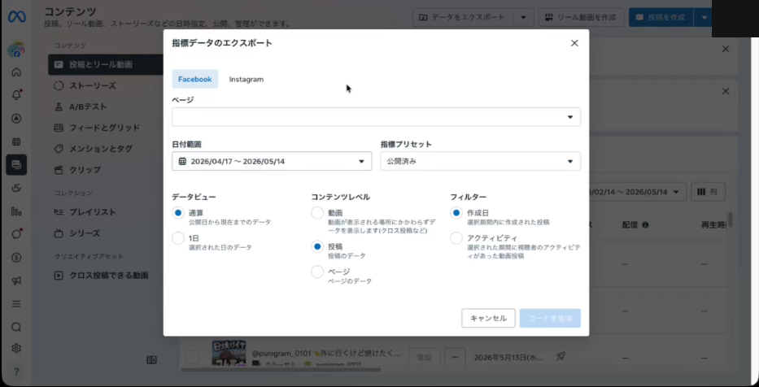

ページプルダウンで連携Facebookページを選択した後の状態がこちら（Instagramタブが押下可能になります）:

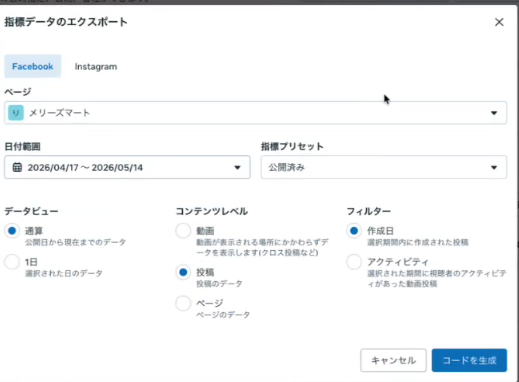

### 12-補-2. スプシにアップロード

1. メニュー「📊 Instagram Insights → **📤 Business Suite CSVインポート（ストーリーズ/フィード/リール自動判定）**」を実行
2. ダイアログで CSV ファイルを選択 → 「アップロード開始」
3. 処理が完了すると以下のサマリが表示されます:
   - 判定: 📖 ストーリーズ / 🎬 リール / 📸 フィード（CSV内の投稿タイプから自動判定）
   - ✅ 新規追加: ◯件
   - 🔗 Meta zip行とマージ: ◯件（zipで先に入っていた行に数値を後付け）
   - ⏭ 既存スキップ: ◯件
   - 💬 キャプション補完: ◯件
4. 該当シート（フィード履歴 / リール履歴 / ストーリーズ履歴）に `source = business_suite_csv` として行が追加されているか確認

> 💡 **重複防止**: 投稿IDで判定するため、同じCSVを2回流しても重複登録されません。Meta zip 由来の行とは投稿日時でマージされ、欠落していた数値が後付けで埋まります。

### 12-補-3. トラブルシューティング: Instagram タブが押せない

エクスポートダイアログの「Instagram」タブがグレーアウトして押せないケースがあります。以下を上から順に確認してください。

#### 1. 「ページ」プルダウンを必ず先に選択

最頻出。ダイアログ右上の「ページ」が空のままだと Instagram タブはグレーアウト固定です。まず連携 Facebook ページを選択してください。

#### 2. Instagram への追加ログインを完了

ビジネス設定でユーザー詳細を開いたとき、「**InstagramとFacebookのその他の管理設定を利用**」というダイアログと「**ログイン**」ボタンが出る場合は、そこから IG アカウントにログインし直してください。ログインしないと管理権限の一部が無効化されます。

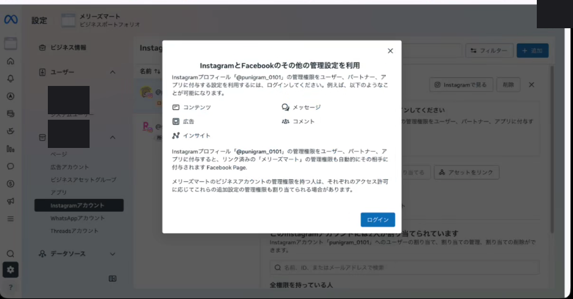

入口: ビジネス設定 → ユーザー → 該当行の「詳細」または Instagramアカウントの「管理」

別パターンとして、ビジネス設定の Instagramアカウント詳細から「ログインしてください」表示が出ることもあります（同様にログインで解消）:

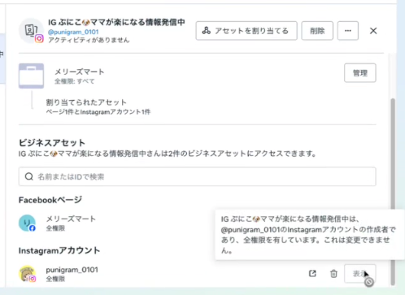

#### 3. ビジネスポートフォリオにアセットとして登録

ユーザー権限だけ付いていても、対象IGアカウントが**ビジネスポートフォリオのアセット**として登録されていないとエクスポート対象になりません。

確認: ビジネス設定 → アカウント → **Instagramアカウント** に対象アカウントが表示されているか
- 表示されていなければ「**追加 → Instagramアカウントを追加**」で登録

#### 4. 自分のアクセス権限を「全権限」に

ビジネス設定 → アカウント → Instagramアカウント → 対象アカウント → 「ユーザー」タブ → 自分の権限が「**部分的なアクセス許可**」になっていたら「管理」から **全権限** に変更。特に「コンテンツ」+「インサイト」の両方が ON である必要があります。

#### 5. Page ↔ Instagram のリンク確認（両側）

両方向のリンクを確認します。

- IG側: ビジネス設定 → アカウント → Instagramアカウント → 対象 → 「接続済みのFacebookページ」に対象FBページがあるか
- FB側: ビジネス設定 → アカウント → ページ → 対象FBページ → 「接続済みのInstagramアカウント」に対象IGがあるか

片側だけリンク済みの状態がたまにあります。両側揃っていない場合は再リンク。

#### 6. ブラウザ要因の切り分け

1. `Cmd+Shift+R` でハードリロード
2. Chrome シークレットウィンドウで再ログインして再試行
3. `facebook.com` / `instagram.com` の Cookie を削除して再ログイン
4. 拡張機能（広告ブロッカー等）の干渉を疑い、無効化して再試行

#### 7. 「アクティブでない」表示について

ビジネス設定 → ユーザー一覧で、IGアカウント自体が「アクティブでない」と表示されることがありますが、これは**そのIGアカウントが BM に一度もログインしたことがない**という意味で、エクスポート可否とは関係ありません（実際にエクスポートに使うのは現在ログイン中の管理者ユーザーの権限）。気にしなくてOK。

### 12-補-4. それでも解決しない場合の代替策

ここまで全部試してもダメな場合、Meta UI 側のバグ・反映遅延の可能性があります。**目的（過去データ取得）を達成する別ルート**に切り替えるのが早いです。

#### A. IGアプリから直接エクスポート（最速）

1. IGアプリ → 対象アカウントのプロフィール
2. 右上 **☰メニュー → インサイト**
3. 期間を指定
4. 右上の **エクスポート/共有アイコン** → CSV を選択 → メールで受信
5. 受信した CSV を Step 12-補-2 のメニューでアップロード

Business Suite と同等の指標（リーチ・インプレッション・保存・プロフアクセス・フォロー）が取得できます。

#### B. Meta公式 zip（Step 12 のルート）

過去全期間を網羅したいなら Step 12 が最強です。Business Suite UI に依存しないので確実。

#### C. Graph API 経由（Step 11 のルート）

直近の数値だけならAPIで取得済みのはずです。Business Suite CSV は「APIで取りこぼした項目を補完する」用途と割り切る考え方もあります。

> 💡 **画像の保管場所について（メンテナンス用メモ）**:
> 公開用画像は `docs/images/setup-guide/business-suite-csv/` 配下に配置済み（プロフィールアバターをマスク処理済み）。マスク前の生スクリーンショットは `docs/images/_raw/setup-guide/business-suite-csv/` に全6枚保管しており、こちらは `.gitignore` 対象でリポジトリには含まれません。実名・メールアドレスを含む 03 / 05 は PII の都合で公開ガイドには採用していません。

---

## Step 13. トリガー設置（自動取得開始）

30分ごとの自動インサイト取得 + 週次の長期トークン自動更新トリガーを設置します。

1. メニュー「📊 Instagram Insights → ⏰ トリガーをインストール」を実行
2. 初回のみ Apps Script の権限承認ダイアログが出る → 「許可」
3. 「トリガーをインストールしました」アラートが表示されたら設置完了
   - `autoFetch`: 30分ごと（インサイト自動取得）
   - `refreshTokenJob`: 毎週日曜 9時(トークン更新）
4. 30分後にスプシを開いて、フィード・リール・ストーリーズの行が自動更新されているか確認

### トリガーの管理

- 現在のトリガー確認: メニュー「📋 トリガー一覧」
- 停止: メニュー「🗑 トリガーを削除」
- 再開: 「⏰ トリガーをインストール」を再実行

> ✅ **🎉 セットアップ完了です** — これで Instagram の全インサイトが30分ごとに自動でスプシに保存され、週次でトークンも自動更新されます。アカウントBAN対策のバックアップとして機能します。

---

## 日々の運用

### 基本方針

- セットアップ後は基本「触らない運用」でOK。30分ごとに自動でデータが追記されます
- 週1回、ダッシュボードシートで「伸びた投稿」「初速良好」「曜日×時間帯ヒートマップ」を確認 → 投稿戦略にフィードバック
- 月1回はスプシを開く（30日以上開かないとトークン失効リスク）
- 2〜3ヶ月に1回、Meta公式zipを再エクスポート → アップロード（過去ストーリーズの追加分を取り込み）

### トラブル時のセルフチェック

1. 「🔍 設定状況を確認」で各PROPSが入っているか
2. 「🔗 接続テスト」で Graph API が応答するか
3. 「📋 トリガー一覧」で `autoFetch` と `refreshTokenJob` が登録されているか
4. Discord通知で何かエラーが出ていないか
5. 解決しない場合はDiscordコミュニティで質問（アフターフォロー加入者）

---

## 規約・データの扱い（重要）

本テンプレートは **Meta公式 Instagram Graph API のみ** を使用し、HTMLスクレイピングは一切行いません。BYO型（Bring Your Own credentials）で各利用者が自分のMeta App・自分のトークン・自分のGoogleアカウント・自分のDriveフォルダで完結する設計のため、配布元（クリエイター）は利用者のトークンや投稿データを一切預かりません。

### 🟢 できること（白）

- Instagram Graph API（Meta公式）の正規利用
- 自分のビジネス/クリエイターアカウントのデータを自分のスプシ・自分のDriveに保存
- Meta公式「アカウントセンター → 情報をダウンロード」zipの正規エクスポートのパース
- BYO型でトークンを自分で管理

### 🔴 やらないこと（黒）

- HTMLスクレイピング（instagram.com 直接叩き）— 規約違反 + 不正アクセス禁止法 + IP BAN
- 第三者の非公開アカウントデータ取得
- アクセストークン集中管理（プラットフォーム規約違反）
- 自動コメント・自動DMスパム — 本テンプレは **読み取り専用**

詳細・グレーゾーンの整理は [できる / 条件付き / できない一覧](./onboarding-expectations.html) を必ず確認してください。

---

## FAQ

### Q. 接続テストで「Instagram API Error」が出る

アクセストークンの権限不足が大半です。`instagram_basic` / `instagram_manage_insights` / `pages_read_engagement` / `pages_show_list` の4つが付いているか確認してください。短期トークンの期限切れ（1時間）も多いので、Graph API Explorer で再取得して短期トークンを再貼り付け → 接続テスト。

### Q. ストーリーズが取れない

API仕様で **24時間以内のみ**取得可能です。過去分は Step 12 の Meta公式zipアップロードを使ってください。また、IGアカウントが「個人」の場合は不可（ビジネス/クリエイターに切替必須）。

### Q. トークンが期限切れになった（60日超過）

「🔄 トークン手動更新」を実行 → 失敗する場合は短期トークンから取り直し（Step 5）。30日以上スプシを開かない期間があると失効リスクが高まるため、月1回以上は開く運用を推奨します。

### Q. Meta zipが50MBを超える

Apps Scriptの制約で50MB以内推奨です。Meta側で「期間」を半年単位などで分割エクスポートし、複数回アップロードで対応してください。

### Q. OCRが動かない

GEMINI_API_KEY が未設定の場合はOCRがスキップされます。[AI Studio](https://aistudio.google.com) で発行・設定シートに貼付してください。無料枠で月数百件は処理可能です。

### Q. 取得したデータを再販してもいい？

自分のアカウントの統計データを **自分のサービス内で使う**のは問題ありません。データを **第三者に再販**する場合は Meta規約・個人情報保護法の確認が別途必要です（クライアントワーク等）。

### Q. 複数アカウント運用したい

1スプシ = 1IGアカウント設計です。複数アカウント分のスプシをコピーすれば対応可能です。同一購入者が複数アカウント運用する場合は問題ありません（追加購入不要）。

---

## アフターフォロー

月額¥500のアフターフォローでDiscordコミュニティ参加・API変更時の追随サポート対応。詳しくは [トップページ](./index.html) を参照。

---

© 2026 BridgeSquare / @tamago_app
[プライバシーポリシー](https://tamagoojiji.github.io/bridgesquare-legal/privacy-policy.html) ｜ [利用規約](https://tamagoojiji.github.io/bridgesquare-legal/terms-of-service.html)
